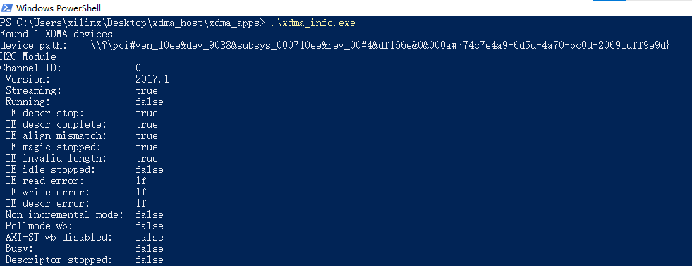
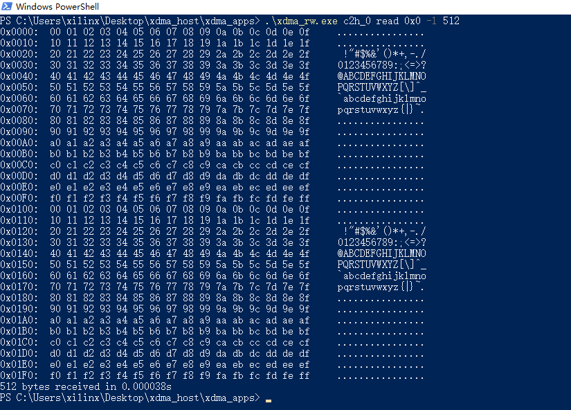

# PCIe -> M.2 -> AI PC
* Supported boards:
    * [ALINX KU042](https://alinx.com/detail/562)
* Tool Version
    * Vivado 2020.2

## Build Hardware
In `hw` folder
```
vivado -notrace -mode batch -source scripts/run.tcl
```
Program the board using the output `*.bit`


## Install Driver
The Windows 10 driver is located in `driver` folder.

## Run Applications
Two applications are provided in `app` folder. Refer to [https://github.com/yiyaowen/xdma_driver_win](https://github.com/yiyaowen/xdma_driver_win) for the source code.
* Get XDMA infomation
    ```
    xdma_info.exe
    ```
    <p align="center">
    
    </p>
    <p align = "center">
    </p>
* Read from XDMA
    ```
    xdma_rw.exe c2h_0 read 0x0 -l 512
    ```
    <p align="center">
    
    </p>
    <p align = "center">
    </p>