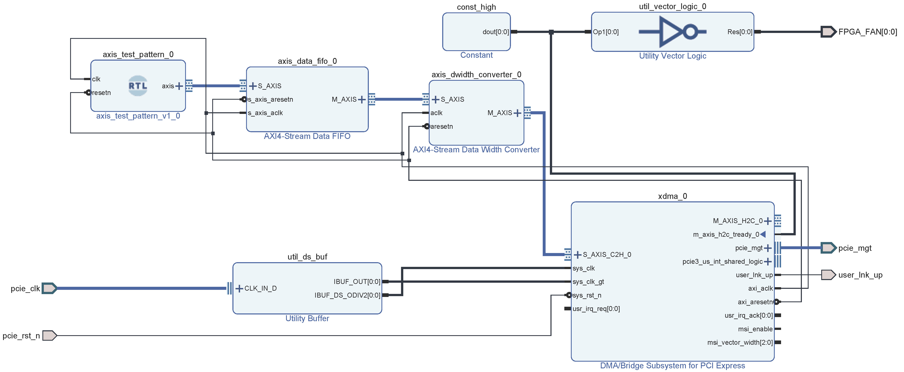

# PCIe -> M.2 -> AI PC
* Supported boards:
    * [ALINX KU042](https://alinx.com/detail/562)
* Tool Version
    * Vivado 2020.2

## Build Hardware
In `hw` folder
```
vivado -notrace -mode batch -source scripts/run.tcl
```

The block design is shown as below, The IP `axis_test_pattern_0` generates stream packets with length 1024.

<p align="center">

</p>
<p align = "center">
</p>

Program the board using the output `*.bit`. **Reboot** the system on each time you program the FPGA.


## Install Driver
The Windows 10 driver is located in `driver` folder.
* Turn off the driver signature enforcement on Windows.
* Specify the driver file in Device Manager.
* Reboot.


## Run Applications
Two applications are provided in `app` folder. Refer to [https://github.com/yiyaowen/xdma_driver_win](https://github.com/yiyaowen/xdma_driver_win) for the source code.
* Get XDMA infomation
    ```
    xdma_info.exe
    ```
    <p align="center">
    
    </p>
    <p align = "center">
    </p>
* Read from XDMA
    ```
    xdma_rw.exe c2h_0 read 0x0 -l 512
    ```
    Run `xdma_rw.exe -h` for the usage
    <p align="center">
    
    </p>
    <p align = "center">
    </p>